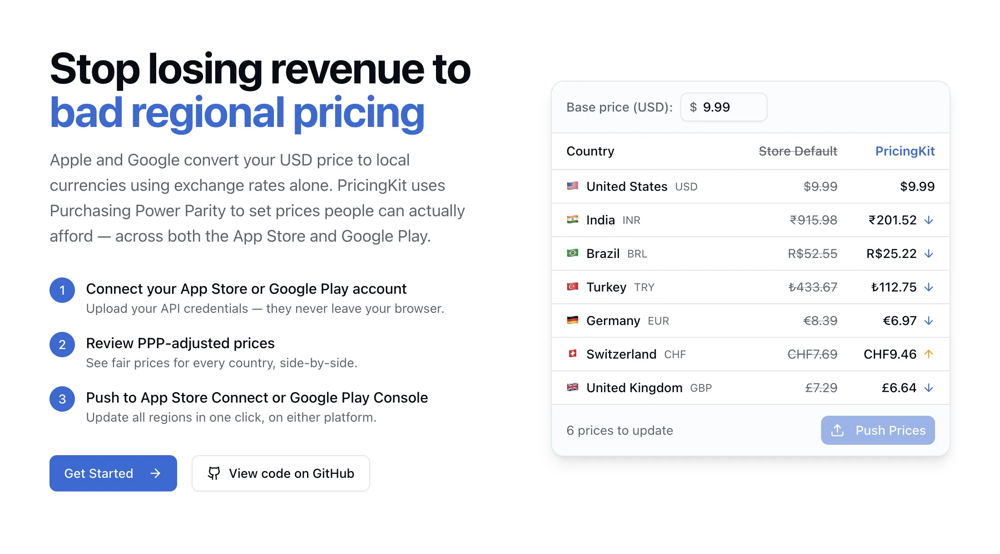

# PricingKit

Free, open-source regional pricing tool for the App Store and Google Play. Set PPP-adjusted prices across 175+ territories in one click &mdash; your credentials never leave your browser.

## Features

- **Multi-platform support** - Manage pricing for both Google Play and Apple App Store from one interface
- **Regional pricing** - View and edit in-app product pricing by region/territory
- **Subscription management** - Manage subscription base plan pricing
- **Bulk updates** - Update prices across multiple products/regions at once
- **Currency conversion** - Automatic exchange rate lookups
- **PPP support** - Purchasing Power Parity adjustments for regional pricing
- **Search & filter** - Find products by SKU/product ID or name

## Getting Started

### Prerequisites

**For Google Play:**
- A Google Cloud project with a service account configured
- Service account JSON credentials with Google Play Developer API access

**For Apple App Store:**
- An App Store Connect API key (.p8 file)
- Your Issuer ID and Key ID from App Store Connect

**See the in-app setup guide** at `/setup-guide` for detailed instructions for both platforms.

### Installation

```bash
npm install
```

### Development

```bash
npm run dev
```

Open [http://localhost:3000](http://localhost:3000) to get started.

### Production Build

```bash
npm run build
npm start
```

## Tech Stack

- **Framework**: Next.js 16 (App Router) with TypeScript
- **Styling**: Tailwind CSS 4 + shadcn/ui
- **State**: Zustand + TanStack Query
- **Forms**: React Hook Form + Zod
- **Google Play API**: googleapis
- **Apple App Store Connect API**: Custom JWT client

## Project Structure

```
src/
├── app/
│   ├── api/              # API routes (Google & Apple endpoints)
│   ├── dashboard/        # Dashboard pages
│   └── setup-guide/      # Setup instructions
├── components/
│   ├── ui/               # shadcn/ui components
│   ├── layout/           # Layout components
│   ├── products/         # Product components
│   └── subscriptions/    # Subscription components
├── lib/
│   ├── google-play/      # Google Play API integration
│   ├── apple-connect/    # Apple App Store Connect API integration
│   ├── exchange-rates/   # Currency conversion
│   └── conversion-indexes/ # PPP data
├── hooks/                # React Query hooks
└── store/                # Zustand stores
```

## Environment Variables

Create a `.env.local` file (optional):

```env
# Custom encryption key for credential storage (recommended for production)
ENCRYPTION_KEY=your-secure-random-string

# Open Exchange Rates API key (for currency conversion)
OPEN_EXCHANGE_RATES_APP_ID=your-api-key
```

## Security

- Credentials are encrypted and stored in HTTP-only cookies
- Credentials are never persisted on the server
- Sessions expire after 24 hours

## License

This project is licensed under the GNU General Public License v3.0 - see the [LICENSE](LICENSE) file for details.

This means you are free to use, modify, and distribute this software, but any derivative works must also be open-sourced under GPL-3.0.

## Support

PricingKit is free and always will be. If you find it useful, consider buying me a coffee!

<a href="https://www.buymeacoffee.com/andyshephard" target="_blank"></a>
